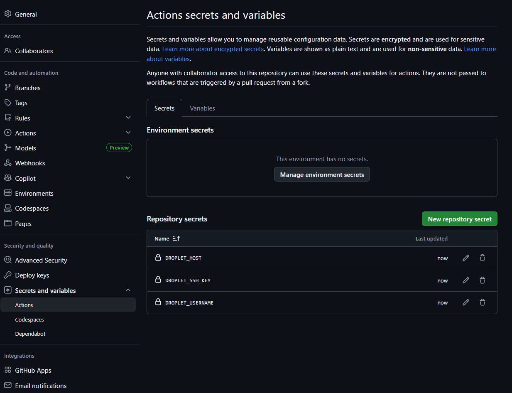

## Palvelimen valmistelu ja CI/CD-yhteyden rakentaminen

Aloitin infran rakentamisen pystyttämällä puhtaan Docker-ympäristön DigitalOcean-palvelimelleni (Debian 13). Tavoitteenani oli luoda turvallinen ja automatisoitava alusta kontitetuille sovelluksilleni.

### 1. Dockerin turvallinen asennus
Ensin päivitin järjestelmän ja asensin vaadittavat työkalut pakettien hakemiseen. Debianin tietoturvakäytäntöjen mukaisesti hain ensin Dockerin virallisen GPG-avaimen, jotta järjestelmä pystyy todentamaan asennettavien pakettien aitouden.

```bash
sudo apt update
sudo apt install -y ca-certificates curl gnupg

# Haetaan ja tallennetaan Dockerin GPG-avain
sudo rm -f /etc/apt/keyrings/docker.gpg
curl -fsSL https://download.docker.com/linux/debian/gpg | sudo gpg --dearmor -o /etc/apt/keyrings/docker.gpg
sudo chmod a+r /etc/apt/keyrings/docker.gpg
```

Tämän jälkeen lisäsin Dockerin virallisen ohjelmistolähteen järjestelmään ja asensin Docker Enginen sekä Docker Compose -liitännäisen:

```bash
echo \
  "deb [arch="$(dpkg --print-architecture)" signed-by=/etc/apt/keyrings/docker.gpg] https://download.docker.com/linux/debian \
  "$(. /etc/os-release && echo "$VERSION_CODENAME")" stable" | \
  sudo tee /etc/apt/sources.list.d/docker.list > /dev/null

sudo apt update
sudo apt install -y docker-ce docker-ce-cli containerd.io docker-buildx-plugin docker-compose-plugin
```

### 2. Käyttöoikeuksien konfigurointi
Jotta pystyn hallitsemaan kontteja (ja jotta CI/CD-automaatio pystyy ajamaan komentoja) ilman root-oikeuksia, lisäsin käyttäjätunnukseni docker-ryhmään ja varmistin asennuksen onnistumisen:

```bash
sudo usermod -aG docker $USER
newgrp docker
docker ps
```

### 3. Yhteyden luominen GitHub Actionsille
Varmistaakseni automaattisten deploymentien toiminnan turvallisesti, loin palvelimelle erillisen, salasanattoman SSH-avaimen (ed25519) yksinomaan GitHub Actionsia varten.

```bash
# Luodaan uusi avain
ssh-keygen -t ed25519 -f ~/.ssh/github_actions -N "" -C "github-actions-deploy"

# Valtuutetaan luotu avain palvelimella
cat ~/.ssh/github_actions.pub >> ~/.ssh/authorized_keys
chmod 600 ~/.ssh/authorized_keys

# Tulostetaan yksityinen avain GitHubia varten
cat ~/.ssh/github_actions
```



Lopuksi siirsin luomani yksityisen avaimen sekä palvelimen kirjautumistiedot turvallisesti GitHub-repositorioni Actions Secrets -asetuksiin. Näin CI/CD-putki pystyy jatkossa ottamaan automaattisesti yhteyden palvelimeeni ja päivittämään Docker-kontit uusimpaan versioon.

### 4. Automaattinen CI/CD-putki (GitHub Actions)

Viimeistelin infrastruktuurin luomalla automaattisen julkaisuputken (`.github/workflows/deploy.yml`). Putki automatisoi sovelluksen päivityksen ja varmistaa, että palvelimella pyörii aina koodin uusin versio.

Putki koostuu seuraavista vaiheista:

- **Checkout:** Haetaan uusin koodi repositoriosta.

- **SCP Transfer:** Kopioidaan projektin tiedostot (mukaan lukien Docker-konfiguraatiot) suojatusti palvelimelle.

- **SSH Execution:** GitHub Actions ottaa SSH-yhteyden palvelimelle ja suorittaa seuraavat komennot:

  - Luo `.env`-tiedoston dynaamisesti GitHub Secrets -salaisuuksista.
  - Ajaa `docker compose down` sammuttaakseen vanhat versiot.
  - Ajaa `docker compose up -d --build` rakentaakseen ja käynnistääkseen uudet kontit taustalle.
  - Siivoaa vanhat turhat Docker-imaget (`docker image prune -f`) levytilan säästämiseksi.

Tämä mahdollistaa täysin automaattisen kehityssyklin: kun pushaan koodia `main`-haaraan, muutokset näkyvät palvelimella (IP: 64.227.70.95) muutamassa minuutissa ilman manuaalisia toimenpiteitä.

📦 **Sovelluksen konttiarkkitehtuuri (Docker Compose)**

Projektin infra koostuu kolmesta toisistaan eristetystä kontista, jotka keskustelevat keskenään Dockerin sisäisessä verkossa:

- **Frontend (Nginx + React):** Tarjoilee staattiset tiedostot portissa 80.
- **Backend (Spring Boot):** Suorittaa liiketoimintalogiikan portissa 8080.
- **Database (PostgreSQL):** Tallentaa datan portissa 5432 (eristetty vain backendin käyttöön).

## Viimeisin commit: Docker-tuki ja infrastruktuurin dokumentaatio

Viimeisin committini sisältää seuraavat päivitykset ja parannukset:

- Lisäsin `backend/glig/Dockerfile`-tiedoston, joka rakentaa Spring Boot -sovelluksen monivaiheisena Docker-kuvana. Dockerfile sisältää myös selkeät englanninkieliset kommentit, jotta rakentamisprosessi on helpompi jakaa muille kehittäjille.
- Lisäsin `frontend/workerfrontend/Dockerfile`-tiedoston, joka rakentaa React/Vite-sovelluksen tuotantoversion ja palvelee sitä nginxillä. Tämä mahdollistaa frontendin ajamisen erillisenä konttina, joka voi kommunikoida backendin kanssa samassa Docker-verkossa.
- Lisäsin `docker-compose.yml`-tiedoston, joka määrittelee kaikki projektin palvelut: PostgreSQL-tietokannan, backendin ja frontendin. Tiedosto myös varmistaa palveluiden käynnistysjärjestyksen ja yhteyksien oikean konfiguroinnin.
- Lisäsin `.dockerignore`-tiedostot sekä backend- että frontend-kansioihin. Näin Docker rakentaa kuvat vain tarvittavista tiedostoista ja jättää pois esimerkiksi riippuvuuskansiot, build-tiedostot ja paikalliset asetukset.
- Lisäsin juurihakemistoon `.env`-mallin, jossa on Auth0-muuttujien paikkamerkit (`AUTH0_ISSUER` ja `AUTH0_AUDIENCE`). Tämä helpottaa ympäristömuuttujien konfigurointia Docker Compose -kokonaisuudessa.
- Päivitin `.gitignore`-tiedoston niin, että se sulkee pois `.env`-tiedoston ja robotin paikallisen seminaaridokumentaation (`SEMINAARI_README.md`). Näin varmistetaan, että paikalliset asetukset ja väliaikaiset tiedostot eivät päädy versionhallintaan.
- Lisäsin dokumentaatioon GitHub Actions Secrets -kuvankaappauksen ja infra-asennusoppaan kuvauksen, jotta myös CI/CD-putken salaisuuksien hallinta ja palvelimen valmistelu näkyvät selkeästi.


Testauksen jakautuminenPäätin eriyttää testit kahteen tasoon niiden luonteen ja vaatimusten mukaan:Backend-testit (GitHub Actions): Maven-pohjaiset JUnit-testit on automatisoitu osaksi CI/CD-putkea. Ne ajetaan ubuntu-latest-ympäristössä aina ennen deploy-vaihetta. Jos testit epäonnistuvat, koodia ei kopioida palvelimelle.  


Robot Framework (Lokaali ajo): End-to-end -testaus on siirretty ajettavaksi paikallisessa kehitysympäristössä. Tämä ratkaisu tehtiin, koska RObotFramwork eisuostunut pelaamaan palvelimen ja actionin kanssa yhdessä. en löytänyt koskaan syytä mikä siinä oli vikana. lokaalisti toimi mutta jokin github actionissa ei pelaa linux palvelimen konttien kanssa.  2. Automaattinen Deploy Pull RequesteissaInfrastruktuuri tukee nyt automaattista julkaisua. Kun uusi koodi pushataan main-haaraan tai sille tehdään Pull Request, järjestelmä suorittaa automaattisesti:


